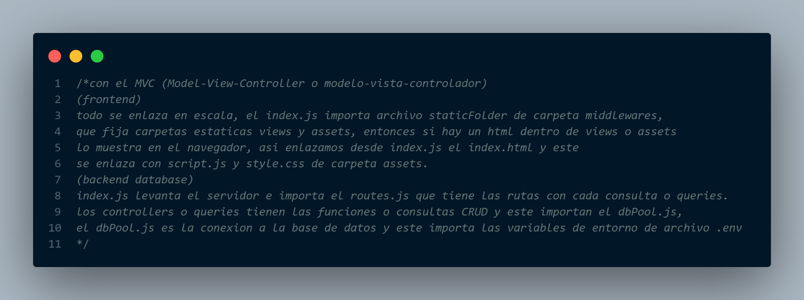
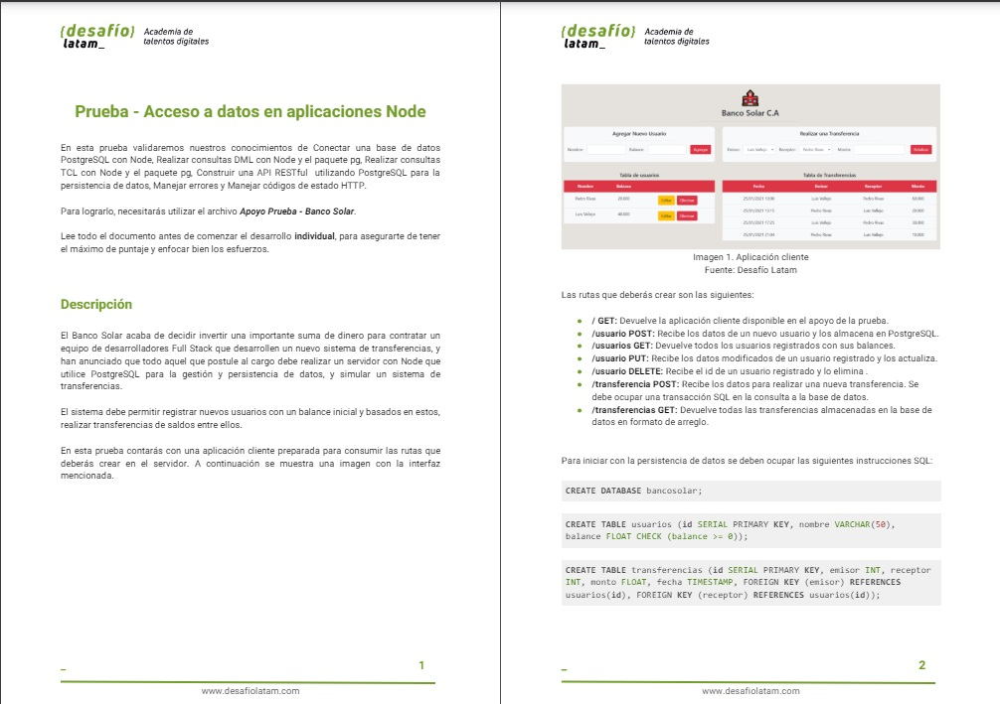
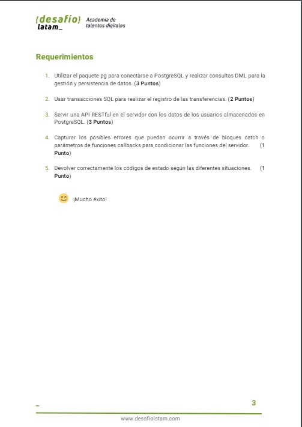

# //--------MODULO 7-PostgreSQL en Node.js--------

 
🚀[Desafío_evaluado_Banco_solar](https://mod-7-desafio-30-prueba-crud.onrender.com)
 
# estructura de carpetas => modelo vista controlador (MVC)
//importaciones = 
index <= rutas <= query <= config conexion <= .env
👨🏽‍💻

          

www.desafiolatam.com
  
my_project/
│
├── assets/
│   ├── sounds/
│   ├── css/
│   │   ├── principal/
│   │   ├── animal/
│   │   └── pokemon/
│   ├── js/
│   │   ├── principal/
│   │   ├── pokemon/
│   │   ├── animal/
│   │   └── videos/
│   ├── img/
│   │   ├── logo.png
│   │   └── background.jpg
│   └── documents/
│
├── config/
│   ├── db.js
│   ├── dbMail.js
│   └── dbSend.js
│
├── controller/
│   ├── sendMail.js
│   └── userController.js
│
├── db/
│   ├── transferencias.sql
│   └── usuarios.sql
│
├── middlewares/
│   └── middlewares.js
│
├── model/
│   ├── transferencias.js
│   └── usuarios.js
│
├── node_modules/
│
├── queries/
│   └── consultas.js
│
├── routes/
│   └── routes.js
│
├── views/
│   ├── inicio.hbs
│   ├── layouts/
│   │   └── main.hbs
│   ├── pages/
│   │   ├── animales.hbs
│   │   ├── pokemon.hbs
│   │   └── videos.hbs
│   └── partials/
│       ├── api-hero.hbs
│       ├── banco.hbs
│       ├── botones-pdf.hbs
│       ├── carousel.hbs
│       ├── colum-grill.hbs
│       ├── footer.hbs
│       ├── form-contact.hbs
│       ├── grid-card.hbs
│       ├── menu.hbs
│       └── background.jpg
│
├── .env
├── .gitignore
├── index.js
├── package-lock.json
├── package.json
└── README.md

 

